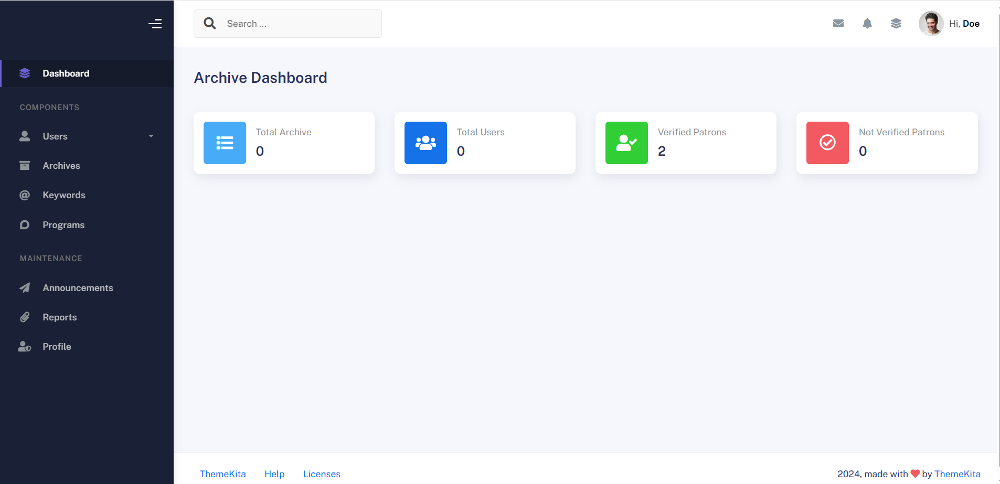
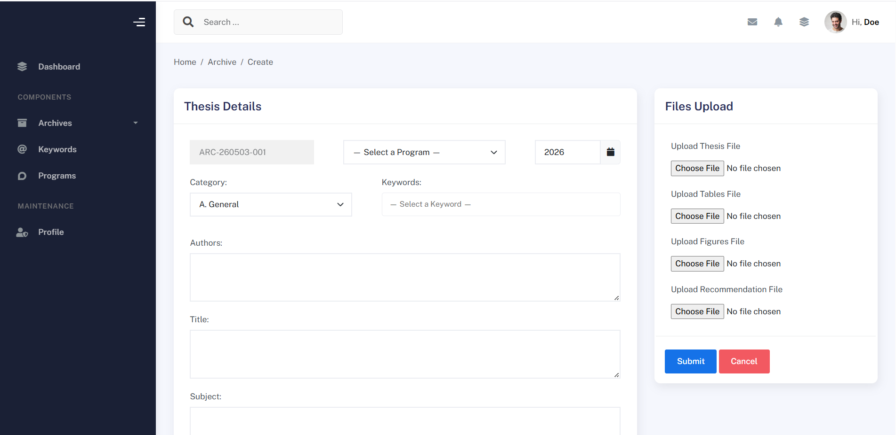

# Document Archive System - Laravel

A specialized enterprise solution for managing document lifecycles. This system ensures that critical business documents are never accidentally lost by using a multi-layer archiving and restoration workflow.

## 📂 Key Features
* **Safe Archiving (Soft Deletes):** Instead of permanent removal, documents are moved to a hidden archive state, preserving data integrity.
* **Batch Restoration:** Ability to recover multiple archived documents simultaneously to the active directory.
* **File Metadata Tracking:** Automatically logs which user archived a file and the exact timestamp of the action.
* **Secure Storage:** Integration with Laravel's Storage facade to handle file paths securely.
* **Searchable Trash:** A dedicated interface to filter and find archived documents before permanent purging.

## 🛠️ Technical Implementation
* **Framework:** Laravel 10.x
* **Database:** MySQL (utilizing `deleted_at` timestamps)
* **Architecture:** Eloquent Trait-based archiving
* **Frontend:** Blade & Tailwind CSS / Bootstrap

## ⚙️ Installation Guide

1. **Clone the repository**
   ```bash
   git clone [https://github.com/begs143/document-archive-system.git](https://github.com/begs143/document-archive-system.git)

Screenshots



